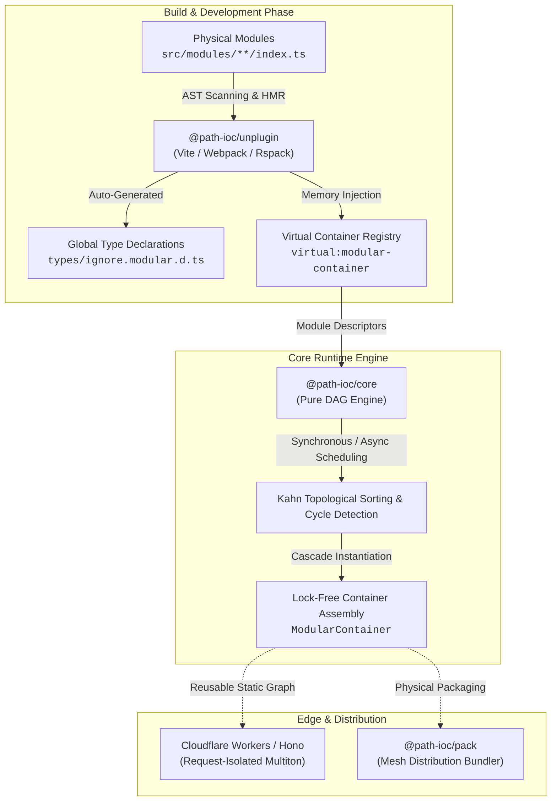

<div align="center">
  <a href="https://path-ioc.dev">
    
  </a>
  <h1>Path-IoC</h1>
  <p><b>Pure Topological Dependency Lookup (IoC-DL) Engine & Universal Modular Utility for Modern TypeScript</b></p>
  <p>Zero-reflection, zero-decorator dependency lookup based on physical file paths.</p>

  <p>
    <a href="https://path-ioc.dev"></a>
    <a href="https://github.com/path-ioc/path-ioc/actions"></a>
    <a href="https://www.npmjs.com/package/@path-ioc/core"></a>
    <a href="https://opensource.org/licenses/MIT"></a>
    <a href="https://www.typescriptlang.org/"></a>
    <a href="https://path-ioc.dev/benchmarks/"></a>
    <a href="https://github.com/sponsors/path-ioc"></a>
  </p>

  <p>
    <a href="./README.zh-CN.md"><b>简体中文</b></a> | English
  </p>
</div>

---

## Overview: The Problem with Traditional TypeScript Imports & IoC

In large-scale web applications and monorepos, codebases typically accumulate thousands of explicit relative `import` statements. Over time, this architecture inevitably leads to:

- **Circular Dependency Deadlocks**: Interdependent files crash at runtime (`TypeError: undefined is not a function`);
- **Heavy Refactoring Friction**: Moving or renaming an infrastructure file cascades into batch editing across dozens of consumer files;
- **Metadata Fragility in Modern Bundlers**: Traditional TypeScript IoC frameworks (NestJS, InversifyJS) depend strictly on `reflect-metadata` and experimental decorators. Under modern bundlers (Vite, Rollup, ESBuild, SWC) that perform pure AST type erasure, runtime reflection fails;
- **Severe Serverless Cold-Start Latency**: Edge environments like Cloudflare Workers enforce tight 10ms–50ms CPU execution limits. Dynamic reflection lookups often exhaust these quotas during request startup.

---

## The Path-IoC Paradigm: Path as Contract

Path-IoC introduces **"Physical Path as Logical Contract"**—a dynamic language architecture that replaces explicit import coupling with topological graph resolution:

1. **Lock-Free Kahn DAG Scheduling**: Powered by Kahn's topological sort, 50 interdependent modules assemble in **`21.2 microseconds (µs)`**;
2. **Zero Decorators, Pure Functions**: Modules export a simple `main(container)` function. No class decorators, no base classes, zero framework intrusion;
3. **Automated TypeScript Type Inference**: Background AST scanning generates complete `ModularContainer` types on file save with 100% accurate IDE auto-completion;
4. **Universal Bundler Ecosystem**: Built on `unplugin` to natively support Vite, Rolldown, Webpack 5, Rspack, Rollup, and Node.js;
5. **Edge & Serverless Native**: Two-stage execution separates one-time static graph compilation from lightweight per-request container instantiation, boosting throughput by over 80%.

---

## Hardware-Verified Benchmarks

Tested on Apple M5 (arm64-darwin) under Node.js v24 (`pnpm bench`):

| Target Function | Complexity | Mean Duration | Evaluation |
| :--- | :--- | :--- | :--- |
| **`instantiateModuleContainer`** | **50 Nodes** | **`21.2 µs`** | Microsecond direct resolution; zero request-time latency |
| **`compileModuleGraph`** | **50 Nodes** | **`90.8 µs`** | Sub-millisecond cycle validation |
| **`instantiateModuleContainer`** | **500 Nodes** | **`227 µs`** | Ultra-large module graphs resolve with negligible cost |
| **`compileModuleGraph`** | **500 Nodes** | **`1.72 ms`** | Executed once on process cold boot, cached permanently |
| **`compileModuleGraph`** | **2,000 Nodes** | **`15.5 ms`** | Industrial-grade deep topology limit |

---

## Architecture Overview



---

## Workspace Packages Matrix

| Package | Role | NPM Version | Documentation |
| :--- | :--- | :--- | :--- |
| [**`@path-ioc/core`**](./packages/core) | Core DAG topological sorting and dependency lookup engine | [](https://www.npmjs.com/package/@path-ioc/core) | [Core Docs](./packages/core/README.md) |
| [**`@path-ioc/unplugin`**](./packages/unplugin) | Universal build plugin (Vite / Webpack / Rspack) for virtual modules and types | [](https://www.npmjs.com/package/@path-ioc/unplugin) | [Plugin Docs](./packages/unplugin/README.md) |
| [**`@path-ioc/container`**](./packages/container) | Advanced container with demand proxy slicing and turbo cycle resolution | [](https://www.npmjs.com/package/@path-ioc/container) | [Container Docs](./packages/container/README.md) |
| [**`@path-ioc/pack`**](./packages/pack) | Physical entrypoint generator and mesh distribution bundler | [](https://www.npmjs.com/package/@path-ioc/pack) | [Pack Docs](./packages/pack/README.md) |
| [**`@path-ioc/benchmarks`**](./packages/benchmarks) | High-precision Mitata performance test suites | Private | [Benchmarks Docs](./packages/benchmarks/README.md) |

---

## 3-Minute Quick Start (Vite Example)

### 1. Install Dependencies
```bash
pnpm add @path-ioc/core
pnpm add -D @path-ioc/unplugin
```

### 2. Configure Bundler (`vite.config.ts`)
```typescript
import { defineConfig } from "vite";
import pathIoc from "@path-ioc/unplugin";

export default defineConfig({
  plugins: [
    pathIoc.vite({
      modulesPath: "src/modules",
      typeFileOutput: "types",
    }),
  ],
});
```

### 3. Author a Module (`src/modules/order-service/index.ts`)
```typescript
// Pure closure factory, 0 decorators, lookup dependencies directly from container
export const main = (container: ModularContainer) => {
  const { dbConnection, userService } = container;

  return {
    async createOrder(item: string, price: number) {
      const user = await userService.getCurrentUser();
      return dbConnection.insert("orders", { item, price, userId: user.id });
    },
  };
};

// Topological prerequisites: directory names are automatically camelCased to short names
export const dependencies = ["dbConnection", "userService"];
```

### 4. Author a Startup Module (`src/modules/start-app/index.ts`)
```typescript
// All business logic stays inside IoC modules to guarantee AOP aspects and topological readiness
export const main = (container: ModularContainer) => {
  const { orderService } = container;
  orderService.createOrder("MacBook Pro M5", 19999);
};

export const dependencies = ["orderService"];
```

### 5. Application Ignition (`src/main.ts`)
```typescript
import { createModularContainer } from "virtual:modular-container";

// Entry file stays 100% clean as a pure ignition trigger with 0 business pollution
createModularContainer();
```

---

## Commercial Showcase: Path-IoC Pro Boilerplate

Looking to launch a profitable SaaS on the edge?  
Explore **[Path-IoC Pro Boilerplate](https://path-ioc.dev/templates/pro-boilerplate)**—a full-stack starter kit combining Cloudflare Workers, Hono, React 19, Path-IoC, Tailwind CSS, Stripe Global Billing, and Cloudflare D1 database.

---

## Sponsors & Community Backers

Path-IoC is an independently maintained, MIT-licensed open-source project. Sustained development is made possible thanks to our sponsors and community backers.

<p align="center">
  <a href="https://github.com/sponsors/path-ioc"></a>
  &nbsp;
  <a href="https://opencollective.com/path-ioc"></a>
  &nbsp;
  <a href="https://afdian.com/a/path-ioc"></a>
</p>

### Backers & Community Contributors

#### Open Collective
<p align="center">
  <a href="https://opencollective.com/path-ioc">
    
  </a>
</p>

#### 爱发电 (Afdian)
<p align="center">
  <a href="https://afdian.com/a/path-ioc">
    
  </a>
</p>

Looking for commercial priority support, custom workshops, or featured placement on our official website? Explore our [Sponsorship Guide & Tiers](https://path-ioc.dev/sponsor) or [Afdian Live Leaderboard](https://afdian.com/a/path-ioc).

---

## Contributing

We welcome community contributions. Please review [CONTRIBUTING.md](./CONTRIBUTING.md) for local development workflows, testing commands, and PR submission guidelines.

---

## License

Released under the [MIT License](./LICENSE).  
Copyright © 2026 [Path-IoC Organization](https://github.com/path-ioc) & Lian HanLin.
