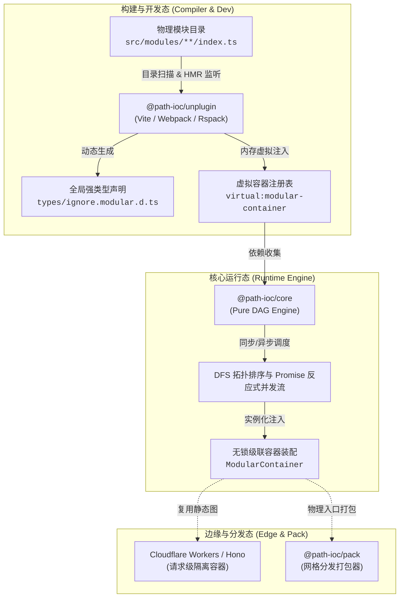

<div align="center">
  <a href="https://path-ioc.dev/zh/">
    
  </a>
  <h1>Path-IoC</h1>
  <p><b>对标原生 ESM 的应用级自组织模块系统与纯依赖查找 (IoC-DL) 拓扑引擎</b></p>
  <p>基于物理文件目录路径的无反射、零装饰器、微秒级拓扑依赖查找与 DAG 调度引擎</p>

  <p>
    <a href="https://path-ioc.dev/zh/"></a>
    <a href="https://github.com/path-ioc/path-ioc/actions"></a>
    <a href="https://www.npmjs.com/package/@path-ioc/core"></a>
    <a href="https://opensource.org/licenses/MIT"></a>
    <a href="https://www.typescriptlang.org/"></a>
    <a href="https://path-ioc.dev/zh/benchmarks/"></a>
    <a href="https://github.com/sponsors/path-ioc"></a>
  </p>

  <p>
    简体中文 | <a href="./README.md"><b>English</b></a>
  </p>
</div>

---

## 实机编码与极速点火演示录屏 (Live Demo Video)

<div align="center">
  <video src="https://cdn.path-ioc.dev/path-ioc/demo-zh.mp4" controls width="100%" playsinline>
    您的浏览器不支持 HTML5 视频播放。<a href="https://cdn.path-ioc.dev/path-ioc/demo-zh.mp4">点击查看实机演示视频</a>
  </video>
  <p><em>⚡ 实机架构漫游：实时编码、拓扑依赖编排与极速容器点火</em></p>
</div>

---

## 概述：传统 TypeScript 依赖与 IoC 框架的深层痛点

在传统大型前端工程与全栈单体中，模块之间充斥着纵横交错的相对路径 `import`。随着业务演进，不可避免地陷入：

- **死锁泥潭与循环依赖（Circular Dependencies）**：物理交叉引用在运行时触发未定义报错（`TypeError: undefined is not a function`）；
- **隐式强耦合，拆分重构举步维艰**：重命名或迁移底层文件波及数十个上层业务代码，重构摩擦极大；
- **传统 TS IoC 方案在现代打包器下的“元数据擦除崩溃”**：NestJS / InversifyJS 强依赖 `reflect-metadata` 与实验性装饰器。在现代打包器（Vite、Rolldown、ESBuild、Rollup、SWC）的纯类型擦除下极易崩溃；
- **边缘计算冷启动严苛限制**：Cloudflare Workers / Serverless 仅有 10ms~50ms CPU 时间限制，传统框架高频元数据查表极易导致冷启动超时；
- **宿主强绑定与框架锁死**：传统框架强行侵入应用入口（如 `main.ts`），导致业务代码与特定 HTTP 框架及专有类装饰器深度绑定。

---

## Path-IoC 的解决之道：路径即契约 (Path as Contract)

Path-IoC 带来全新的 **“物理路径即逻辑契约”** 架构设计：

1. **应用级自组织模块系统（Application-Level Mesh Module System）**：对标原生 ESM，作为业务层自组织网格。宿主（Hono、Express、Koa、Next.js API、Workers、CLI 等）只做一行代码点火（`createModularContainer()`），业务模块在网格内自闭环运转，不挑宿主，零框架锁死；
2. **基于 DFS 拓扑排序与 Promise 反应式并发流**：依托深度优先搜索（DFS）后序遍历压栈拓扑排序与 Promise.all 记忆化反应式并发流，50 节点依赖装配仅需 **`21.2 微秒 (µs)`**；
3. **物理路径即特征（Feature）与短名称 Mesh ID**：物理路径前缀（如 `/infra/`、`/biz/`）作为特征标签（类比元数据注解），静态依赖直接使用极简短名称（如 `dependencies = ["logger", "db"]`），直接解构并享受全局类型推导；
4. **零装饰器与纯函数闭包**：无需任何类装饰器与元数据反射，纯函数工厂 `main(container)` 导出，依托动态语言函数一等公民实现纯正无侵入的面向切面编程；
5. **编译器-运行时协同设计（Compiler-Runtime Co-design）**：`@path-ioc/unplugin` 维护单图编译缓存闭包（冷启动单次编译 1.72ms，后续点火仅 21.2µs），AST 监听器实现 0.04ms 实时类型生成；
6. **全构建工具生态适配**：基于 `unplugin` 规范，一套配置原生适配 Vite、Rolldown、Webpack 5、Rspack、Rollup 与 Node.js，完美契合 Edge/Serverless CPU 纳秒级响应限制。

---

## 硬核基准性能 (Benchmarks)

基于 Apple M5 芯片、Node.js v24 原生实测（运行 `pnpm bench`）：

| 压测指标 (Benchmark Item) | 复杂度规模 | 平均耗时 (Avg Time) | 性能表现说明 |
| :--- | :--- | :--- | :--- |
| **`instantiateModuleContainer`** | **50 节点** 容器实例化 | **`21.2 µs`** | 微秒级直通，Serverless HTTP 请求期 0 延迟 |
| **`compileModuleGraph`** | **50 节点** 静态图编译 | **`90.8 µs`** | 亚毫秒级完成全拓扑环路校验 |
| **`instantiateModuleContainer`** | **500 节点** 容器实例化 | **`227 µs`** | 超大型项目依然近乎零开销 |
| **`compileModuleGraph`** | **500 节点** 复杂交叉依赖 | **`1.72 ms`** | 进程冷启动仅需 1 次，随后全量缓存复用 |
| **`compileModuleGraph`** | **2,000 节点** 超大规模拓扑 | **`15.5 ms`** | 工业级深层拓扑解析极限 |

---

## 架构全景图 (Architecture)



---

## Packages 模块矩阵

本项目采用 **pnpm Monorepo** 多包架构：

| 子包 (Package) | 职责定位 (Responsibility) | NPM 状态 | 文档指南 |
| :--- | :--- | :--- | :--- |
| [**`@path-ioc/core`**](./packages/core) | **核心引擎**：纯净、极速的拓扑依赖解析与图调度（浏览器/Node/Worker 通用） | [](https://www.npmjs.com/package/@path-ioc/core) | [查看核心文档](./packages/core/README.md) |
| [**`@path-ioc/unplugin`**](./packages/unplugin) | **编译器-运行时协同插件**：跨构建器插件（Vite/Rolldown/Webpack/Rspack），单图编译缓存与微秒级类型生成 | [](https://www.npmjs.com/package/@path-ioc/unplugin) | [查看插件文档](./packages/unplugin/README.md) |
| [**`@path-ioc/container`**](./packages/container) | **高阶实验容器**：Demand Proxy 懒加载与子图切片（历史概念对比与评测包，非生产推荐包） | [](https://www.npmjs.com/package/@path-ioc/container) | [查看容器扩展](./packages/container/README.md) |
| [**`@path-ioc/pack`**](./packages/pack) | **分发打包**：专用于 Mesh 网格独立依赖打包分发的发布构建插件 | [](https://www.npmjs.com/package/@path-ioc/pack) | [查看打包文档](./packages/pack/README.md) |
| [**`@path-ioc/benchmarks`**](./packages/benchmarks) | **性能压测**：基于 Mitata 的高精度多场景性能测试套件 | 私有包 | [查看压测文档](./packages/benchmarks/README.md) |

---

## 3 分钟快速上手 (以 Vite 为例)

### 1. 安装核心依赖
```bash
pnpm add @path-ioc/core
pnpm add -D @path-ioc/unplugin
```

### 2. 配置构建插件 (`vite.config.ts`)
```typescript
import { defineConfig } from "vite";
import pathIoc from "@path-ioc/unplugin";

export default defineConfig({
  plugins: [
    pathIoc.vite({
      modulesPath: "src/modules",   // 模块存放目录 (默认 src/modules)
      typeFileOutput: "types",     // 生成的 .d.ts 存放目录
    }),
  ],
});
```

### 3. 编写业务模块 (`src/modules/order-service/index.ts`)
```typescript
// 纯函数闭包工厂，零装饰器，直接使用短名称 Mesh ID 依赖查找 (IoC-DL)
export const dependencies = ["dbConnection", "userService"];

export const main = ({ dbConnection, userService }: ModularContainer) => {
  return {
    async createOrder(item: string, price: number) {
      const user = await userService.getCurrentUser();
      return dbConnection.insert("orders", { item, price, userId: user.id });
    },
  };
};
```

### 4. 编写启动业务模块 (`src/modules/start-app/index.ts`)
```typescript
// 一切业务皆模块：初始调用收敛在 IoC 模块内，天然保障 AOP 切面与依赖拓扑就绪
export const dependencies = ["orderService"];

export const main = ({ orderService }: ModularContainer) => {
  orderService.createOrder("MacBook Pro M5", 19999);
};
```

### 5. 宿主应用入口点火唤醒 (`src/main.ts`)
```typescript
import { createModularContainer } from "virtual:modular-container";

// 宿主点火边界：入口保持绝对纯粹，仅充当一行点火器，零业务逻辑污染
createModularContainer();
```

---

## 商业化套件与出海脚手架

打造出海高毛利业务？  
探索 **[Path-IoC Pro Boilerplate](https://path-ioc.dev/zh/templates/pro-boilerplate)**——面向独立开发者与出海团队的生产级全栈 SaaS 模板，集成 Cloudflare Workers、Hono、React 19、Path-IoC、Tailwind CSS、Stripe 国际支付与 Cloudflare D1 边缘数据库。

---

## 赞助与社区致谢 (Sponsors & Backers)

Path-IoC 是一套由个人与开源社区独立维护的 MIT 协议开源工程。您的资助将直接支持内核研发、无反射拓扑算法演进与双语技术文档的持续维护。

<p align="center">
  <a href="https://github.com/sponsors/path-ioc"></a>
  &nbsp;
  <a href="https://afdian.com/a/path-ioc"></a>
  &nbsp;
  <a href="https://opencollective.com/path-ioc"></a>
</p>

### 社区致谢与赞助者名单 (Backers)

#### Open Collective 赞助者
<p align="center">
  <a href="https://opencollective.com/path-ioc">
    
  </a>
</p>

#### 爱发电 (Afdian) 赞助者
<p align="center">
  <a href="https://afdian.com/a/path-ioc">
    
  </a>
</p>

如果您或您的企业希望获得商业优先支持、架构重构诊断咨询、或在官方主站及 README 获得赞助商 Logo 曝光，请查阅我们的 [赞助权益与分级指南](https://path-ioc.dev/zh/sponsor) 或前往 [爱发电实时赞助榜](https://afdian.com/a/path-ioc)。

---

## 贡献指南 (Contributing)

我们非常欢迎社区参与贡献！无论是报告 Bug、改进文档还是提交性能优化，请先阅读 [CONTRIBUTING.md](./CONTRIBUTING.md) 了解本地开发、测试与 PR 提交流程。

---

## 开源协议 (License)

本项目采用 [MIT License](./LICENSE) 协议开源。  
Copyright © 2026 [Path-IoC Organization](https://github.com/path-ioc) & Lian HanLin.
