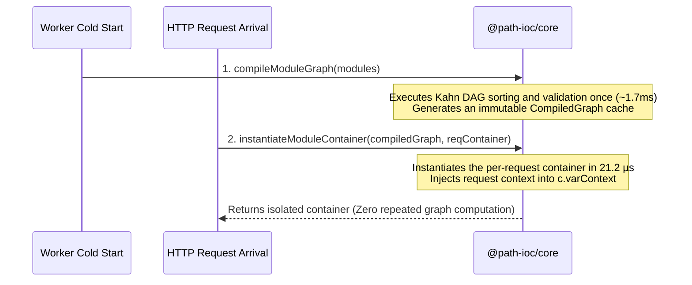

# Edge Computing & Serverless Best Practices

In serverless edge runtimes such as Cloudflare Workers and Vercel Edge Functions, execution CPU time is strictly governed by physical runtime quotas (for instance, Cloudflare Workers free plan enforces a **10ms ~ 50ms CPU execution limit**).

Traditional IoC frameworks frequently exhaust edge CPU quotas due to dynamic class reflection, metadata table traversal, and recursive dependency tree resolution on every HTTP request.

---

## The Core Architecture: "Static Graph Singleton + Request-Scoped Multiton Containers"

Path-IoC resolves this bottleneck through a strict two-stage separation:



---

## Production Implementation with Hono & Cloudflare Workers

### 1. Request Context Isolation via Middleware

```typescript
import { Hono, Context } from "hono";
import { createModularContainer } from "virtual:modular-container";

type AppEnv = {
  Variables: {
    modularContainer: ModularContainer;
  };
};

const app = new Hono<AppEnv>();

// Mount isolated container per HTTP request inside middleware
app.use("*", async (c, next) => {
  const reqContainer = {
    varContext: c, // Inject request context (headers, auth, environment bindings)
  } as any;

  // Reuses pre-compiled DAG graph under the hood. Instantiation takes only 21.2 µs!
  await createModularContainer(reqContainer);

  c.set("modularContainer", reqContainer);
  await next();
});

// Route handlers consume services cleanly
app.get("/api/orders", async (c) => {
  const { orderService } = c.get("modularContainer");
  const data = await orderService.listMyOrders();
  return c.json({ result: true, data });
});

export default app;
```

---

## Heavy Resource Memoization: Process-Level Singletons (`memoizeModule`)

In request-isolated architectures, heavy resources like database connection pools or Redis clients should not be reconstructed per request. A lightweight closure memoizer ensures cross-request singleton persistence:

```typescript
// Helper utility: Process-level singleton closure
export const memoizeModule = <T extends (...args: any[]) => any>(fn: T): T => {
  let cache: any;
  let initialized = false;
  return ((...args: any[]) => {
    if (!initialized) {
      cache = fn(...args);
      initialized = true;
    }
    return cache;
  }) as T;
};

// src/modules/infra/db-pool/index.ts
export const main = memoizeModule((container: ModularContainer) => {
  const { varContext } = container;
  // Connection pool initialized once on first cold request, reused by all subsequent requests
  const pool = createDbPool(varContext.env.DATABASE_URL);
  return pool;
});
```
