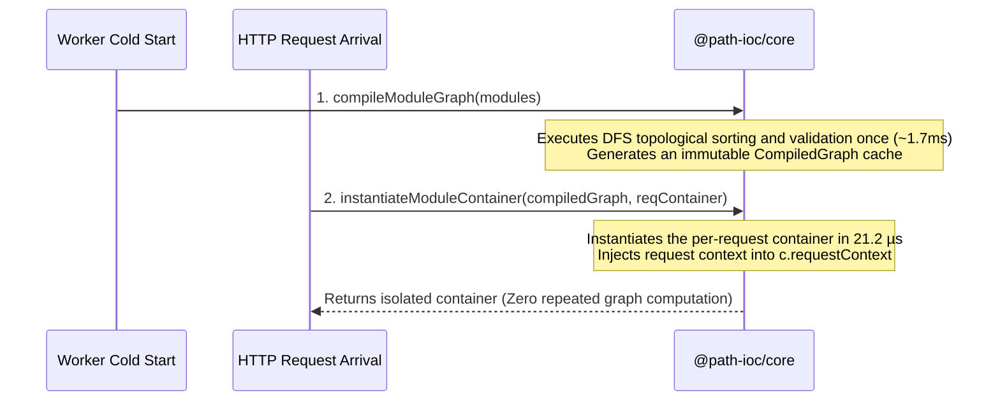

# Edge Computing & Serverless Best Practices

In serverless edge runtimes such as Cloudflare Workers and Vercel Edge Functions, execution CPU time is strictly governed by physical runtime quotas (for instance, Cloudflare Workers free plan enforces a **10ms ~ 50ms CPU execution limit**).

Traditional IoC frameworks frequently exhaust edge CPU quotas due to dynamic class reflection, metadata table traversal, and recursive dependency tree resolution on every HTTP request.

---

## The Core Architecture: "Static Graph Singleton + Request-Scoped Multiton Containers"

Path-IoC resolves this bottleneck through a strict two-stage separation:


```mermaid
sequenceDiagram
    participant Worker as Worker Cold Start
    participant Request as HTTP Request Arrival
    participant Engine as @path-ioc/core

    Worker->>Engine: 1. compileModuleGraph(modules)
    Note over Engine: Executes DFS topological sorting and validation once (~1.7ms)<br>Generates an immutable CompiledGraph cache

    Request->>Engine: 2. instantiateModuleContainer(compiledGraph, reqContainer)
    Note over Engine: Instantiates the per-request container in 21.2 µs<br>Injects request context into c.requestContext
    Engine-->>Request: Returns isolated container (Zero repeated graph computation)
```

---

## Production Implementation with Hono & Cloudflare Workers

### 1. Wildcard Gateway & Per-Request Container Isolation

In the Hono entry point, the host maintains zero business routes, passing the current request's `c` context directly into the container as a seed object:

```typescript
// src/index.ts
import { Hono } from "hono";
import { createModularContainer } from "virtual:modular-container";

const app = new Hono();

// Wildcard API Gateway: Like Spring MVC DispatcherServlet, delegates all routing to the container
// Reuses the pre-compiled DAG static graph under the hood. Per-request container hydration takes only 21.2 µs!
app.all("*", async (c) => {
  // Pass current request context as seed object, overriding the skip-marked requestContext module
  const container = await createModularContainer({ requestContext: c });

  // 💡 Delegates to the internal apiAggregator module for URL contract matching and unified AOP governance
  return await container.apiAggregator();
});

export default app;
```

---

### 2. Standard External Injection Contract: `skip: true`

To give `container.requestContext` 100% complete TypeScript IDE auto-completion without manual global declaration merging, simply declare standard contracts under the module directory:

```typescript
// src/modules/request-context/index.ts
import type { Context } from "hono";

// 💡 External Injection Contract:
// 1. Marked with skip: true: container skips dummy main; seed object provides the real instance;
// 2. unplugin extracts the return type automatically, ambiently generating 100% type-safe completion.
export const skip = true;
export const main = (): Context => ({}) as Context;
```

---

## Heavy Resource Memoization: Process-Level Singletons (`memoizeModule`)

In request-isolated architectures, heavy resources like database connection pools or Redis clients should not be reconstructed per request. A pure higher-order closure ensures cross-request singleton persistence.

> 📘 **Deep Dive Recommendation**: For a comprehensive architectural analysis on falsy value safety, Promise cache poisoning defense, and self-healing resilience:  
> 👉 [**Process-Level Singletons via Closure Caching: The memoizeModule Pattern in Production**](/articles/memoize-module-pattern)

```typescript
// src/modules/infra/db-pool/index.ts
import { memoizeModule } from "../../../utils/memoizeModule";
import { createPool } from "mysql2/promise";

export const dependencies = [];

export const main = memoizeModule(async (container: ModularContainer) => {
  const { requestContext } = container;
  // Connection pool initialized once on first cold request, reused by all subsequent requests in isolate!
  const pool = await createPool(requestContext.env.DATABASE_URL);
  return pool;
});
```

> 💡 **Edge Environment Variables & Cross-Request Singletons**:  
> In Cloudflare Workers and Hono, environment bindings (such as `DATABASE_URL`) are attached to the per-request context `c.env`, as there is no traditional Node.js global `process.env`.
>
> Because environment bindings are immutable across requests within the same Worker process instance, extracting configuration on the first request to initialize a persistent connection pool via `memoizeModule` is the idiomatic edge pattern.
>
> ⚠️ **Safety Boundary**: Ensure that `memoizeModule` closures **only access immutable configuration from `requestContext.env`**, and never capture request-specific mutable state (such as headers or user sessions), avoiding cross-request data leaks.
