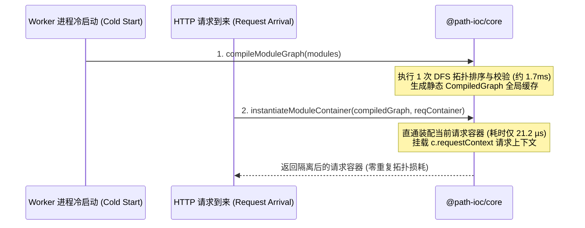

# 边缘计算与 Serverless 最佳实践

在 Cloudflare Workers、Vercel Edge Functions 等 Serverless 边缘环境中，CPU 执行时间通常受到极其严苛的物理限制（例如 Cloudflare Workers 免费计划仅有 **10ms ~ 50ms CPU Time** 限制）。

传统的 IoC 框架由于每次请求都需要反编译类、查元数据表与动态解析依赖树，极易耗尽边缘 CPU 时间导致超时报错。

---

## 核心架构：“静态图单例 + 请求级容器多例”

Path-IoC 针对 Serverless 边缘架构确立了两阶段彻底解耦机制：



---

## 在 Hono / Cloudflare Workers 中的实战代码

### 1. 中间件隔离当前请求上下文

```typescript
import { Hono, Context } from "hono";
import { createModularContainer } from "virtual:modular-container";

type AppEnv = {
  Variables: {
    modularContainer: ModularContainer;
  };
};

const app = new Hono<AppEnv>();

// 在 HTTP 中间件中挂载请求级隔离容器
app.use("*", async (c, next) => {
  const reqContainer = {
    requestContext: c, // 注入当前请求的 Context (包含 Headers, Auth, Env 等)
  } as any;

  // 内部自动复用启动期预编译的 DAG 静态图，填充仅耗时 21.2 微秒！
  await createModularContainer(reqContainer);

  c.set("modularContainer", reqContainer);
  await next();
});

// 通配 API 网关分发 (类似 SpringMVC DispatcherServlet，入口处绝不手写具体业务路由！)
// 业务接口一律由 src/modules/api/** 物理路径模块承载，并由 apiAggregator 模块进行统一调度与 AOP 切面拦截
app.all("*", async (c) => {
  const { apiAggregator } = c.get("modularContainer");
  return await apiAggregator();
});

export default app;
```

---

## 重型资源复用：进程级单例高阶函数 (`memoizeModule`)

在多请求隔离模式下，数据库连接池（Connection Pool）或 Redis 客户端无需每次请求都重复创建。可以使用高阶函数闭包实现跨请求的全局单例复用：

```typescript
// 辅助函数：进程级单例闭包 (生产推荐实现)
export const memoizeModule = <
  Result,
  T extends (
    modularContainer: ModularContainer,
    moduleDeclarationNames: string[]
  ) => Result
>(
  main: T
): T => {
  let result: Result;
  let initialized = false;
  return ((
    modularContainer: ModularContainer,
    moduleDeclarationNames: string[]
  ) => {
    if (!initialized && (initialized = true)) {
      result = main(modularContainer, moduleDeclarationNames);
    }
    return result;
  }) as T;
};

// src/modules/infra/db-pool/index.ts
export const main = memoizeModule((container: ModularContainer) => {
  const { requestContext } = container;
  // 仅在首次请求时创建连接池，后续所有 HTTP 请求直接共享同一连接实例！
  const pool = createDbPool(requestContext.env.DATABASE_URL);
  return pool;
});
```

> 💡 **边缘环境环境变量与跨请求单例说明**：  
> 在 Cloudflare Workers / Hono 环境中，所有外部 Bindings 与环境变量（如 `DATABASE_URL`）均统一挂载在请求上下文 `c.env` 上，并不存在传统 Node.js 的全局 `process.env`。  
> 
> 由于同一个 Worker 实例内的基础设施配置（`c.env.DATABASE_URL`）跨请求是不可变的，因此利用 `memoizeModule` 在首个请求到达时提取配置、初始化全局连接池并在后续请求中持续复用，是完全顺应边缘物理运行时的设计范式。  
> 
> ⚠️ **安全边界**：请确保在 `memoizeModule` 闭包内部**仅提取跨请求不可变的基础设施配置（如 `requestContext.env`）**，绝不能在单例闭包中持有特定请求的动态数据（如 `requestContext.req.header` 或用户会话），以免引起跨请求上下文泄漏。
