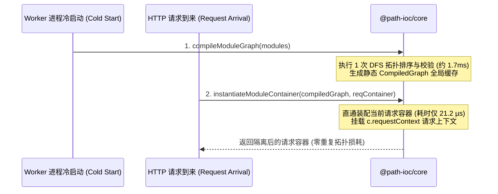

# 边缘计算与 Serverless 最佳实践

在 Cloudflare Workers、Vercel Edge Functions 等 Serverless 边缘环境中，CPU 执行时间通常受到极其严苛的物理限制（例如 Cloudflare Workers 免费计划仅有 **10ms ~ 50ms CPU Time** 限制）。

传统的 IoC 框架由于每次请求都需要反编译类、查元数据表与动态解析依赖树，极易耗尽边缘 CPU 时间导致超时报错。

---

## 核心架构：“静态图单例 + 请求级容器多例”

Path-IoC 针对 Serverless 边缘架构确立了两阶段彻底解耦机制：


```mermaid
sequenceDiagram
    participant Worker as Worker 进程冷启动 (Cold Start)
    participant Request as HTTP 请求到来 (Request Arrival)
    participant Engine as @path-ioc/core

    Worker->>Engine: 1. compileModuleGraph(modules)
    Note over Engine: 执行 1 次 DFS 拓扑排序与校验 (约 1.7ms)<br>生成静态 CompiledGraph 全局缓存

    Request->>Engine: 2. instantiateModuleContainer(compiledGraph, reqContainer)
    Note over Engine: 直通装配当前请求容器 (耗时仅 21.2 µs)<br>挂载 c.requestContext 请求上下文
    Engine-->>Request: 返回隔离后的请求容器 (零重复拓扑损耗)
```

---

## 在 Hono / Cloudflare Workers 中的实战代码

### 1. 通配网关与请求级容器隔离

在 Hono 入口处，宿主环境保持 0 具体业务路由维护，以单行通配分发将当前请求的 `c` 上下文作为种子对象传入容器：

```typescript
// src/index.ts
import { Hono } from "hono";
import { createModularContainer } from "virtual:modular-container";

const app = new Hono();

// 通配 API 网关分发 (类似 Spring MVC DispatcherServlet，入口处绝不手写具体业务路由！)
// 内部自动复用启动期预编译的 DAG 静态图，每个请求填充容器仅耗时 21.2 微秒！
app.all("*", async (c) => {
  // 将当前请求 Context 作为种子传入，自动覆盖带 skip: true 的 requestContext 模块
  const container = await createModularContainer({ requestContext: c });

  // 💡 委托给容器内部聚合网关模块调度执行，并在模块内闭环实现统一切面治理
  return await container.apiAggregator();
});

export default app;
```

---

### 2. 统一外部注入契约：`skip: true`

为了让 `container.requestContext` 享受 100% 完整的 TypeScript 智能补全，无需手动声明全局合并，只需在模块目录下建立标准契约声明：

```typescript
// src/modules/request-context/index.ts
import type { Context } from "hono";

// 💡 外部注入契约：
// 1. 标记 skip: true，运行时容器跳过执行，由外部种子对象注入；
// 2. unplugin 自动提取类型推导，为全局容器挂载强类型 requestContext。
export const skip = true;
export const main = (): Context => ({}) as Context;
```

---

## 重型资源复用：进程级单例高阶函数 (`memoizeModule`)

在多请求隔离模式下，数据库连接池（Connection Pool）或 Redis 客户端无需每次请求都重复创建。可以使用纯函数高阶闭包实现跨请求的全局单例复用。

> 📘 **深度专栏推荐**：关于假值防击穿、异步 Promise 缓存毒化防御与冷启动自愈的完整工业级推演，详见专栏深度解析：  
> 👉 [**《进程级单例与闭包缓存原语：memoizeModule 设计哲学与生产实践》**](/zh/articles/memoize-module-pattern)

```typescript
// src/modules/infra/db-pool/index.ts
import { memoizeModule } from "../../../utils/memoizeModule";
import { createPool } from "mysql2/promise";

export const dependencies = [];

export const main = memoizeModule(async (container: ModularContainer) => {
  const { requestContext } = container;
  // 仅在当前 Worker 实例的首个请求到达时提取环境变量并创建连接池，后续请求稳定复用！
  const pool = await createPool(requestContext.env.DATABASE_URL);
  return pool;
});
```

> 💡 **边缘环境环境变量与跨请求单例说明**：  
> 在 Cloudflare Workers / Hono 环境中，所有外部 Bindings 与环境变量（如 `DATABASE_URL`）均统一挂载在请求上下文 `c.env` 上，并不存在传统 Node.js 的全局 `process.env`。
>
> 由于同一个 Worker 实例内的基础设施配置（`c.env.DATABASE_URL`）跨请求是不可变的，因此利用 `memoizeModule` 在首个请求到达时提取配置、初始化全局连接池并在后续请求中持续复用，是完全顺应边缘物理运行时的设计范式。
>
> ⚠️ **安全边界**：请确保在 `memoizeModule` 闭包内部**仅提取跨请求不可变的基础设施配置（如 `requestContext.env`）**，绝不能在单例闭包中持有特定请求的动态数据（如 `requestContext.req.header` 或用户会话），以免引起跨请求上下文泄漏。
